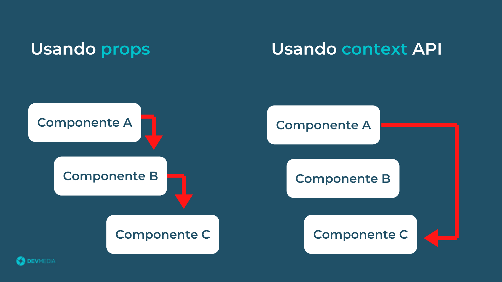

# O que é Contexto no React?

O contexto no React é uma forma de compartilhar dados entre componentes sem a necessidade de passar esses dados manualmente através de props em cada nível da árvore de componentes. Ele permite que você tenha um "estado global" que pode ser acessado por qualquer componente dentro de um determinado escopo.

## Como Funciona?
1. Criação: Você cria um contexto que serve como um contêiner para os dados que deseja compartilhar.

2. Provider: O contexto tem um componente especial chamado Provider. Ao usar o Provider, você define quais dados (ou estado) estarão disponíveis para os componentes que estão "dentro" dele.

3. Consumer: Para acessar os dados, os componentes usam um mecanismo (chamado Consumer) que permite que eles leiam os valores do contexto. Isso pode ser feito de maneira direta ou usando um hook que simplifica o acesso.

4. Reatividade: Quando os dados no contexto mudam, todos os componentes que consomem esses dados são atualizados automaticamente. Isso facilita a criação de interfaces dinâmicas.

## Quando Usar?
1. Prop Drilling: Quando você tem que passar dados através de muitos níveis de componentes apenas para que um componente final consiga acessá-los.

2. Dados Globais: Quando você precisa que várias partes do seu aplicativo acessem e compartilhem o mesmo estado, como informações de autenticação ou preferências do usuário.

## Vantagens e Desvantagens:
- Vantagens: Reduz a complexidade de passar props manualmente, facilita a centralização de dados e melhora a organização do código.

- Desvantagens: Pode levar a re-renderizações desnecessárias e complicar o gerenciamento do estado se usado em demasia.

...Em progresso...
